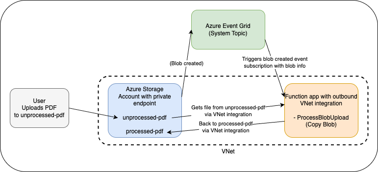

<!--
---
name: Azure Functions Java Event Grid Blob Trigger using Azure Developer CLI
description: This template repository contains an Azure Functions reference sample using the Blob trigger with Event Grid source type, written in Java and deployed to Azure using the Azure Developer CLI (azd). The sample uses managed identity and a virtual network to make sure deployment is secure by default.
page_type: sample
products:
- azure
- azure-functions
- azure-blob-storage
- azure-virtual-network
- entra-id
urlFragment: functions-quickstart-java-azd-eventgrid-blob
languages:
- java
- bicep
- azdeveloper
---
-->

# Azure Functions Java Event Grid Blob Trigger using Azure Developer CLI

This template repository contains an Azure Functions reference sample using the Blob trigger with Event Grid source type, written in Java and deployed to Azure using the Azure Developer CLI (`azd`). When deployed to Azure the sample uses managed identity and a virtual network to make sure deployment is secure by default. You can control whether a VNet is used to secure storage in the sample by setting `VNET_ENABLED` to true or false in the AZD parameters.

This sample implements a simple function that copies PDF files from an `unprocessed-pdf` container to a `processed-pdf` container when new blobs are created using byte array bindings. This straightforward example showcases how to use the Event Grid blob trigger to automatically respond to blob creation events in near real-time.



## Benefits of Event Grid Blob Trigger

This sample uses the Event Grid source type for the Blob trigger, which provides significant advantages over the traditional scan-based approach:

- **Near real-time processing**: Event Grid delivers blob events within milliseconds of creation, eliminating the delays associated with container scanning.
- **Improved scalability**: Perfect for Flex Consumption plans where the traditional polling-based Blob trigger isn't available.
- **Reduced costs**: Eliminates storage transaction costs from polling, which can be substantial with large numbers of blobs.
- **Enhanced reliability**: Uses a robust pub/sub model that ensures blob events aren't missed, even during function downtime.
- **Better performance**: No performance degradation with large numbers of blobs in a container, unlike the scan-based approach.

The Event Grid approach is recommended for all new Blob trigger implementations, especially when using Flex Consumption plans where the traditional storage polling method isn't available.

## Prerequisites

- [Azure Developer CLI](https://learn.microsoft.com/en-us/azure/developer/azure-developer-cli/install-azd)
- [Java 17+](https://docs.microsoft.com/en-us/java/openjdk/download#openjdk-17)
- [Maven 3.0+](https://maven.apache.org/download.cgi)
- [Azure Functions Core Tools](https://learn.microsoft.com/azure/azure-functions/functions-run-local?pivots=programming-language-java#install-the-azure-functions-core-tools)
- To use Visual Studio Code to run and debug locally:
  - [Visual Studio Code](https://code.visualstudio.com/)
  - [Azure Storage extension](https://marketplace.visualstudio.com/items?itemName=ms-azuretools.vscode-azurestorage)
  - [Azure Functions extension](https://marketplace.visualstudio.com/items?itemName=ms-azuretools.vscode-azurefunctions)
  - [Extension Pack for Java](https://marketplace.visualstudio.com/items?itemName=vscjava.vscode-java-pack)
  - [REST Client](https://marketplace.visualstudio.com/items?itemName=humao.rest-client)
- [Azurite](https://learn.microsoft.com/en-us/azure/storage/common/storage-use-azurite) to emulate Azure Storage services when running locally

Optional for uploading blobs:

- [Azure CLI](https://learn.microsoft.com/en-us/cli/azure/install-azure-cli) or
- [Azure Storage Explorer](https://azure.microsoft.com/en-us/products/storage/storage-explorer/#Download-4)

## Initialize the local project

To initialize a project from this `azd` template, clone the GitHub template repository locally using the `git clone` command:

```bash
git clone https://github.com/Azure-Samples/functions-quickstart-java-azd-eventgrid-blob.git
cd functions-quickstart-java-azd-eventgrid-blob
```

You can also clone the repository from your own fork in GitHub.

# Start and prepare the local storage emulator

Azure Functions uses Azurite to emulate Azure Storage services when running locally. If you haven't done so, [install Azurite](https://learn.microsoft.com/en-us/azure/storage/common/storage-use-azurite#install-azurite).

Create two containers in the local storage emulator called `processed-pdf` and `unprocessed-pdf`. Follow these steps:

1. Ensure Azurite is running. For more details see [Run Azurite](https://learn.microsoft.com/en-us/azure/storage/common/storage-use-azurite#run-azurite)

2. Use Azure Storage Explorer, or the VS Code Storage Extension to create the containers.

3. Upload the PDF files from the `data` folder to the `unprocessed-pdf` container.

## Run your app

**Using the terminal**

- Navigate to the src directory and build the project:

    ```bash
    cd src
    mvn clean package
    ```

- From the src folder, run this command to start the Functions host locally:

    ```bash
    mvn azure-functions:run
    ```

**Using Visual Studio Code**

- Open the project folder in a new terminal.
- Run the `code .` command to open the project in Visual Studio Code.
- Navigate to the src directory: `cd src`
- Build the project: `mvn clean package`
- In the command palette (F1), type `Azurite: Start`, which enables debugging without warnings.
- Press **F5** to run in the debugger. Make a note of the `localhost` URL endpoints, including the port, which might not be `7071`.

## Trigger the function

Now that the storage emulator is running, has files on the `unprocessed-pdf` container, and our app is running, we can execute the `ProcessBlobUpload` function to simulate a new blob event.

- If you are using VS Code, Visual Studio, or other tooling that supports .http files, you can open the [`test.http`](./test.http) project file, update the port on the `localhost` URL (if needed), and then click on Send Request to call the locally running `ProcessBlobUpload` function. This will trigger the function to process the `Benefit_Options.pdf` file. You can update the file name in the JSON to process other PDF files.

## Source Code

The function code for the `ProcessBlobUpload` endpoint is defined in [`ProcessBlobUpload.java`](./src/src/main/java/com/microsoft/azure/samples/ProcessBlobUpload.java). The `@FunctionName` annotation applied to the `run` method sets the name of the function endpoint. It uses a byte array for the blob trigger and an output binding to copy the processed blob to the destination container.

```java
@FunctionName("ProcessBlobUpload")
@StorageAccount("PDFProcessorSTORAGE")
public void run(
    @BlobTrigger(
        name = "sourceBlob",
        path = "unprocessed-pdf/{name}",
        source = "EventGrid"
    ) byte[] sourceBlob,
    @BindingName("name") String blobName,
    @BlobOutput(
        name = "outputBlob",
        path = "processed-pdf/processed-{name}"
    ) OutputBinding<byte[]> outputBlob,
    final ExecutionContext context) {

    Logger logger = context.getLogger();
    long blobSize = sourceBlob.length;
    logger.info(String.format("Java Blob Trigger (using Event Grid) processed blob\n Name: %s \n Size: %d bytes", blobName, blobSize));

    // Here you can add any processing logic for the input blob before uploading it to the processed container.
    // For this example, we're just copying the blob content as-is
    
    outputBlob.setValue(sourceBlob);
    logger.info(String.format("PDF processing complete for %s. Blob copied to processed container with new name processed-%s.", blobName, blobName));
}
```

## Verify that the files were copied

Now that you have triggered the function, use the Azure Storage Explorer, or the VS Code Storage Extension, to check that the `processed-pdf` container has the processed file in the local storage emulator.

## Deploy to Azure

Login to the Azure Developer CLI if you haven't already:

```bash
azd auth login
```

Run this command from the base folder to provision the function app and other required Azure Azure resources, and deploy your code:

```bash
azd up
```

By default, an Azure virtual network is created, a private endpoint is configured on the storage account, and VNet integration is configured on the function app so it can reach the storage account. You can opt-out of a VNet being used in the sample. To do so, use `azd env` to configure `VNET_ENABLED` to `false` before running `azd up`:

```bash
azd env set VNET_ENABLED false
azd up
```

The first time you run `azd up` you will be prompted to supply these required deployment parameters:

| Parameter | Description |
| ---- | ---- |
| _Environment name_ | An environment that's used to maintain a unique deployment context for your app. You won't be prompted if you created the local project using `azd init`.|
| _Azure subscription_ | Azure subscription in which your resources are created.|
| _Azure location_ | Azure region in which to create the resource group that contains the new Azure resources. You can double check what regions support Flex Consumption [using the AZ CLI](https://learn.microsoft.com/cli/azure/functionapp?view=azure-cli-latest#az-functionapp-list-flexconsumption-locations).|

This `azd up` command will perform the following steps for you:

- Provision a new resource group and all resources needed for the sample
- Deploy the function app code to the function app
- Run the post-up script from the `scripts` folder to configure the event grid subscription to point to the new function app for any new blobs added to the `unprocessed-pdf` storage container.

## Test on Azure

To test your deployed function, you can upload PDF files to the `unprocessed-pdf` container and verify they are automatically processed and copied to the `processed-pdf` container.

### Configure Storage Access (VNet Deployment Only)

If you deployed with VNet enabled (the default), you'll need to add your local IP address to the storage account firewall before you can upload files:

1. Get your public IP address by visiting [whatismyipaddress.com](https://whatismyipaddress.com/) or running:

    ```bash
    curl ifconfig.me
    ```

2. Configure the storage account network access settings using Azure CLI:

    ```bash
    # Get the storage account name from your deployment
    STORAGE_ACCOUNT=$(azd env get-values | grep "AZURE_STORAGE_ACCOUNT_NAME" | cut -d'=' -f2 | tr -d '"')
    
    # Enable public network access and set to selected networks
    az storage account update --name $STORAGE_ACCOUNT --public-network-access Enabled --default-action Deny
    
    # Add your IP to the firewall (replace YOUR_IP with your actual IP)
    az storage account network-rule add --account-name $STORAGE_ACCOUNT --ip-address YOUR_IP
    ```

Alternatively, you can configure this through the Azure portal:

- Navigate to your storage account
- Go to **Security + networking** > **Networking**
- Set **Public network access** to **Enabled** and **Public network access scope** to **Enable from selected networks**
- Add your local IP address to the **IPv4 Addresses** allowed list

### Upload Test Files

1. **Using Azure CLI:**

    ```bash
    # Upload a test PDF file to the unprocessed-pdf container
    STORAGE_ACCOUNT=$(azd env get-values | grep "AZURE_STORAGE_ACCOUNT_NAME" | cut -d'=' -f2 | tr -d '"')
    az storage blob upload --account-name $STORAGE_ACCOUNT --container-name unprocessed-pdf --name test.pdf --file ./data/Benefit_Options.pdf --auth-mode login
    ```

2. **Using Azure Storage Explorer:**

- Connect to your Azure storage account
- Navigate to the `unprocessed-pdf` container
- Upload PDF files from the `data` folder

3. **Using Azure Portal:**

- Go to your storage account in the Azure portal
- Select **Containers** > **unprocessed-pdf**
- Click **Upload** and select PDF files to upload

### Verify Processing

After uploading files, check that they were processed:

1. **Monitor function execution:**

- In the Azure portal, go to your Function App
- In the **Overview** page click on **Invocations and more** for the **ProcessBlobUpload** function
- You should see invocation logs showing the blob processing. Note this could take a few minutes to reflect.

2. **Check processed files:**

- Navigate to the `processed-pdf` container in your storage account
- Verify that files appear with the `processed-` prefix
- For example, `test.pdf` should become `processed-test.pdf`

The Event Grid blob trigger should process files within seconds of upload, demonstrating the near real-time capabilities of this approach.

## Redeploy your code

You can run the `azd up` command as many times as you need to both provision your Azure resources and deploy code updates to your function app.

>[!NOTE]
>Deployed code files are always overwritten by the latest deployment package.

## Clean up resources

When you're done working with your function app and related resources, you can use this command to delete the function app and its related resources from Azure and avoid incurring any further costs:

```bash
azd down
```
