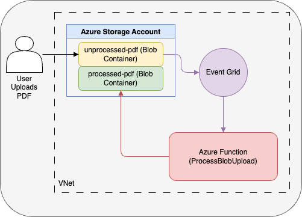

<!-- YAML front-matter schema: https://review.learn.microsoft.com/en-us/help/contribute/samples/process/onboarding?branch=main#supported-metadata-fields-for-readmemd -->

# Azure Functions Java Event Grid Blob Trigger using Azure Developer CLI

This template repository contains an Azure Functions reference sample using the Blob trigger with Event Grid source type, written in Java and deployed to Azure using the Azure Developer CLI (`azd`). When deployed to Azure the sample uses managed identity and a virtual network to make sure deployment is secure by default. You can control whether a VNet is used in the sample by setting `VNET_ENABLED` to true or false in the AZD parameters.

This sample implements a simple function that copies PDF files from an `unprocessed-pdf` container to a `processed-pdf` container when new blobs are created. This straightforward example showcases how to use the Event Grid blob trigger to automatically respond to blob creation events in near real-time.



## Benefits of Event Grid Blob Trigger

This sample uses the Event Grid source type for the Blob trigger, which provides significant advantages over the traditional scan-based approach:

- **Near real-time processing**: Event Grid delivers blob events within milliseconds of creation, eliminating the delays associated with container scanning.
- **Improved scalability**: Perfect for Flex Consumption plans where the traditional polling-based Blob trigger isn't available.
- **Reduced costs**: Eliminates storage transaction costs from polling, which can be substantial with large numbers of blobs.
- **Enhanced reliability**: Uses a robust pub/sub model that ensures blob events aren't missed, even during function downtime.
- **Better performance**: No performance degradation with large numbers of blobs in a container, unlike the scan-based approach.

The Event Grid approach is recommended for all new Blob trigger implementations, especially when using Flex Consumption plans where the traditional storage polling method isn't available.

## Prerequisites

+ [Azure Developer CLI](https://learn.microsoft.com/en-us/azure/developer/azure-developer-cli/install-azd)
+ [Java 17+](https://docs.microsoft.com/en-us/java/openjdk/download#openjdk-17)
+ [Maven 3.0+](https://maven.apache.org/download.cgi)
+ [Azure Functions Core Tools](https://learn.microsoft.com/azure/azure-functions/functions-run-local?pivots=programming-language-java#install-the-azure-functions-core-tools)
+ To use Visual Studio Code to run and debug locally:
  + [Visual Studio Code](https://code.visualstudio.com/)
  + [Azure Storage extension](https://marketplace.visualstudio.com/items?itemName=ms-azuretools.vscode-azurestorage)
  + [Azure Functions extension](https://marketplace.visualstudio.com/items?itemName=ms-azuretools.vscode-azurefunctions)
  + [Extension Pack for Java](https://marketplace.visualstudio.com/items?itemName=vscjava.vscode-java-pack)
  + [REST Client](https://marketplace.visualstudio.com/items.com/items?itemName=humao.rest-client)
+ [Azurite](https://learn.microsoft.com/en-us/azure/storage/common/storage-use-azurite) to emulate Azure Storage services when running locally

Optional for uploading blobs:

+ [Azure CLI](https://learn.microsoft.com/en-us/cli/azure/install-azure-cli) or
+ [Azure Storage Explorer](https://azure.microsoft.com/en-us/products/storage/storage-explorer/#Download-4)

## Initialize the local project

To initialize a project from this `azd` template, clone the GitHub template repository locally using the `git clone` command:

    ```bash
    git clone https://github.com/Azure-Samples/functions-quickstart-java-azd-eventgrid-blob.git
    cd functions-quickstart-java-azd-eventgrid-blob
    ```

    You can also clone the repository from your own fork in GitHub.

# Start and prepare the local storage emulator

Azure Functions uses Azurite to emulate Azure Storage services when running locally. If you haven't done so, [install Azurite](https://learn.microsoft.com/en-us/azure/storage/common/storage-use-azurite#install-azurite).

Create two containers in the local storage emulator called `processed-pdf` and `unprocessed-pdf`. Follow these steps:

1. Ensure Azurite is running. For more details see [Run Azurite](https://learn.microsoft.com/en-us/azure/storage/common/storage-use-azurite#run-azurite)

2. Use Azure Storage Explorer, or the VS Code Storage Extension to create the containers.

   **Using Azure Storage Explorer:**
   + Install [Azure Storage Explorer](https://azure.microsoft.com/en-us/products/storage/storage-explorer/#Download-4)
   + Open Azure Storage Explorer.
   + Connect to the local emulator by selecting `Attach to a local emulator.`
   + Navigate to the `Blob Containers` section.
   + Right-click and select `Create Blob Container.`
   + Name the containers `processed-pdf` and `unprocessed-pdf`.

   **Using VS Code Storage Extension:**
   + Install the VS Code [Azure Storage extension](https://marketplace.visualstudio.com/items?itemName=ms-azuretools.vscode-azurestorage)
   + Ensure Azurite is running
   + Click on the Azure extension icon in VS Code
   + Under `Workspace`, expand `Local Emulator`
   + Right click on `Blob Containers` and select `Create Blob Container`
   + Name the containers `processed-pdf` and `unprocessed-pdf`

3. Upload the PDF files from the `data` folder to the `unprocessed-pdf` container.

   **Using Azure Storage Explorer:**
    + Open Azure Storage Explorer.
    + Navigate to the `unprocessed-pdf` container.
    + Click on "Upload" and select "Upload Folder" or "Upload Files."
    + Choose the `data` folder or the specific PDF files to upload.
    + Confirm the upload to the `unprocessed-pdf` container.

   **Using VS Code Storage Extension:**
   + Install the VS Code [Azure Storage extension](https://marketplace.visualstudio.com/items?itemName=ms-azuretools.vscode-azurestorage)
   + Ensure Azurite is running
   + Click on the Azure extension icon in VS Code
   + Under `Workspace`, expand `Local Emulator`, expand `Blob Containers`
   + Right click on `unprocessed-pdf` and select `Open in Explorer`
   + Copy and paste all the pdf files from the `data` folder to it

## Run your app

  **Using the terminal**

+ Navigate to the src directory and build the project:

    ```bash
    cd src
    mvn clean package
    ```

+ From the src folder, run this command to start the Functions host locally:

    ```bash
    func start
    ```

  **Using Visual Studio Code**

+ Open the project folder in a new terminal.
+ Run the `code .` command to open the project in Visual Studio Code.
+ Navigate to the src directory: `cd src`
+ Build the project: `mvn clean package`
+ In the command palette (F1), type `Azurite: Start`, which enables debugging without warnings.
+ Press **F5** to run in the debugger. Make a note of the `localhost` URL endpoints, including the port, which might not be `7071`.

## Trigger the function

Now that the storage emulator is running, has files on the `unprocessed-pdf` container, and our app is running, we can execute the `processBlobUpload` function to simulate a new blob event.

+ If you are using VS Code, Visual Studio, or other tooling that supports .http files, you can open the [`test.http`](./test.http) project file, update the port on the `localhost` URL (if needed), and then click on Send Request to call the locally running `processBlobUpload` function. This will trigger the function to process the `Benefit_Options.pdf` file. You can update the file name in the JSON to process other PDF files.

## Source Code

The function code for the `processBlobUpload` endpoint is defined in [`ProcessBlobUpload.java`](./src/src/main/java/com/microsoft/azure/samples/ProcessBlobUpload.java). The function uses Java annotations and the `@BlobTrigger` annotation with Event Grid source configuration.

    ```java
    @FunctionName("processBlobUpload")
    @StorageAccount("PDFProcessorSTORAGE")
    public void processBlobUpload(
        @BlobTrigger(
            name = "blob",
            path = "unprocessed-pdf/{name}",
            source = "EventGrid"
        ) byte[] blobContent,
        @BindingName("name") String blobName,
        final ExecutionContext context) {
        // Function implementation
    }
    ```

The `copyToProcessedContainer` method uses the Azure Storage Blob SDK for Java to upload the processed file to the destination blob container.

## Deploy to Azure

Login to the Azure Developer CLI if you haven't already:

```bash
azd auth login
```

Run this command from the base folder to provision the function app and other required Azure Azure resources, and deploy your code:

```bash
azd up
```

If required you can opt-out of a VNet being used in the sample. To do so, use `azd env` to configure `VNET_ENABLED` to `false` before running `azd up`:

```bash
azd env set VNET_ENABLED false
azd up
```

You're prompted to supply these required deployment parameters:

| Parameter | Description |
| ---- | ---- |
| _Environment name_ | An environment that's used to maintain a unique deployment context for your app. You won't be prompted if you created the local project using `azd init`.|
| _Azure subscription_ | Subscription in which your resources are created.|
| _Azure location_ | Azure region in which to create the resource group that contains the new Azure resources. Only regions that currently support the Flex Consumption plan are shown.|

After publish completes successfully, the new resource group will have a storage account and the `processed-pdf` and `unprocessed-pdf` containers. Upload PDF files from the data folder to the `unprocessed-pdf` folder and then check `processed-pdf` for the file.

## Redeploy your code

You can run the `azd up` command as many times as you need to both provision your Azure resources and deploy code updates to your function app.

>[!NOTE]
>Deployed code files are always overwritten by the latest deployment package.

## Clean up resources

When you're done working with your function app and related resources, you can use this command to delete the function app and its related resources from Azure and avoid incurring any further costs:

```bash
azd down
```
